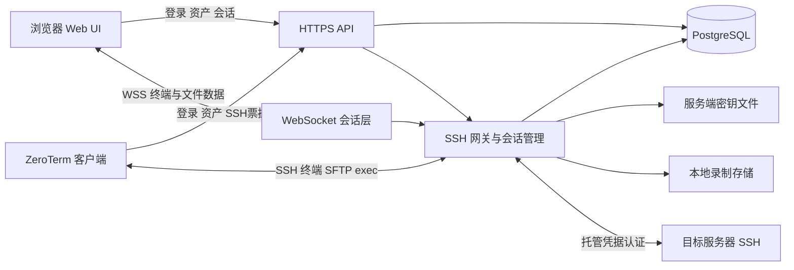
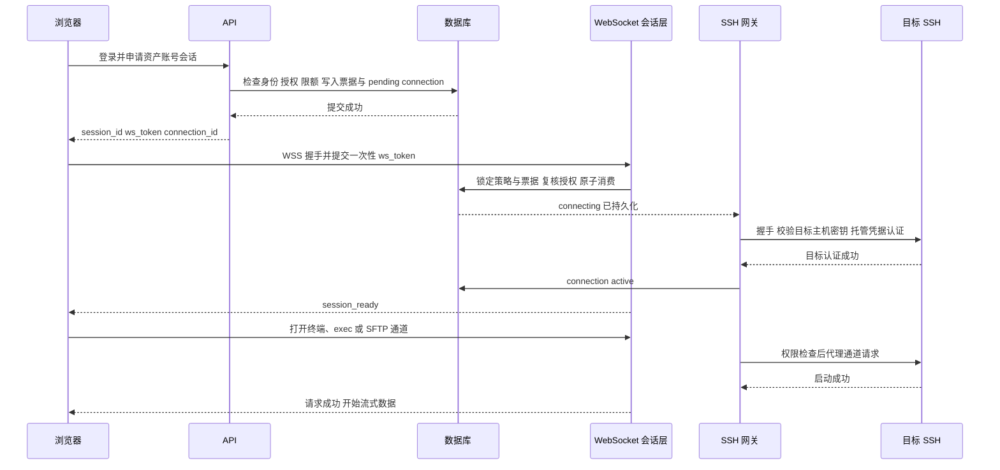
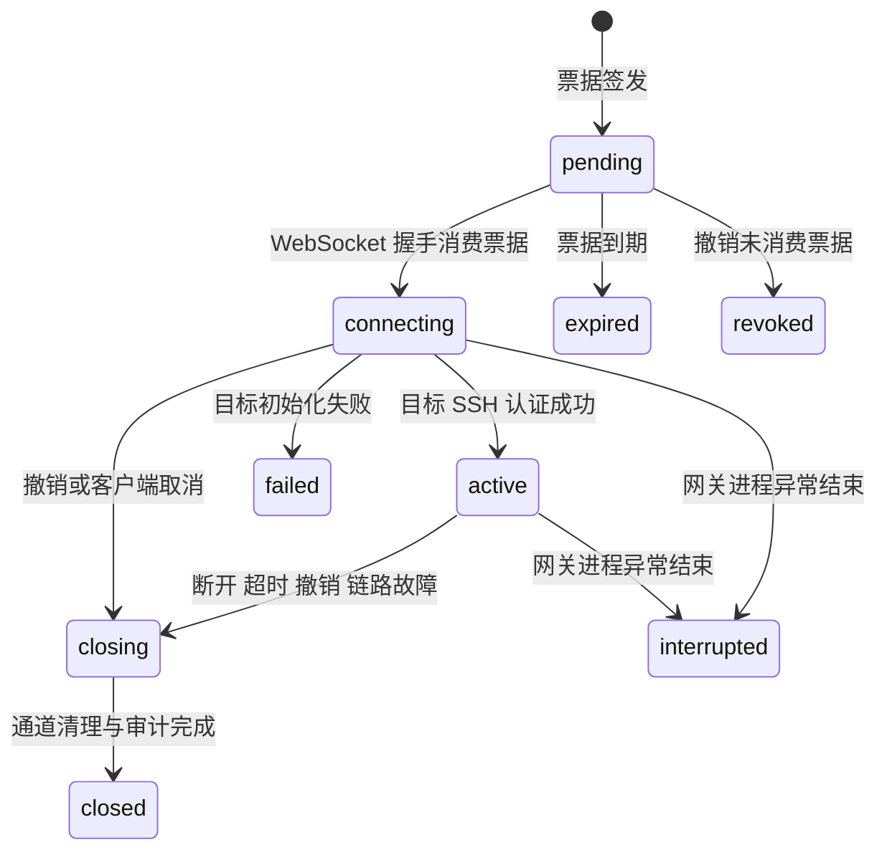

# RFC-004: Web 堡垒机设计与实施方案

| 项目 | 内容 |
|---|---|
| 状态 | Draft，可作为第一版实现基线 |
| 日期 | 2026-10-04 |
| 适用对象 | Web 前端、堡垒机后端、运维与测试人员 |
| 关联文档 | [项目说明](./README.md) |
| 实现状态 | 本文是设计；除明确标为现有能力的部分外，接口、类型、目录和配置均待实现 |

本文定义一个独立、完整、可单独部署的自托管 Web 堡垒机。管理员在 Web 界面配置目标 SSH 服务器及其账号凭据，用户在浏览器登录、选择授权资产并打开终端或文件管理器。堡垒机自身完整负责用户、资产、授权、SSH 连接、SFTP、exec、审计和会话管理，不依赖 ZeroTerm 才能工作。浏览器目标会话遵循 `浏览器 → Web 堡垒机 → 目标 SSH`，目标密码和私钥不下发给浏览器。

设计采用 HTTPS API、WebSocket 数据面与服务端 SSH 会话代理。浏览器使用 xterm.js 等终端组件，终端输入、输出、尺寸变化和 SFTP 数据通过 WebSocket 或受保护的 HTTP 流传输；浏览器不直接建立 SSH 连接。与此同时，系统提供独立的 ZeroTerm 集成入口：ZeroTerm 可以通过同一套用户、资产和授权 API 申请 SSH 连接票据，再使用标准 SSH 连接到堡垒机。ZeroTerm 是额外接入方式，不是堡垒机运行前提。第一版提供用户授权、Web 会话票据、ZeroTerm SSH 票据、会话事件及终端输出录制。完整文件操作审计、精确命令控制、多节点高可用作为后续扩展。

文中的“必须”是实现约束，“默认”是可配置初始值，“建议”允许在保持协议与安全语义的前提下调整。容量和性能数字是验收目标，不是已测结果。

## 1. 需求与范围

### 1.1 核心用户流程

1. 管理员在 Web 管理界面创建资产，例如生产应用服务器，并配置地址与 SSH 端口。
2. 管理员添加一个或多个目标账号，例如 deploy、ops，并录入密码或私钥及其口令。
3. 管理员审核目标主机密钥，分配用户对资产账号的访问能力。
4. 用户在浏览器打开堡垒机地址并登录自己的账号。
5. Web 前端展示可访问资产、可使用目标账号及能力。
6. 用户选择资产账号，打开浏览器终端、文件管理器或服务器工具。
7. 前端申请一次性 WebSocket 会话票据并建立 WSS 连接；服务端用托管凭据登录目标并代理通道。
8. 管理员在 Web 界面查看会话和审计记录，必要时撤销授权并断开会话。

用户登录堡垒机的账号与目标系统账号是两个独立身份。登录用户 alice 可以被授权使用目标账号 deploy；目标系统是否具备 sudo 能力由目标账号自身决定。

### 1.2 第一版范围

| 功能 | 第一版行为 |
|---|---|
| 部署 | 单组织、单网关进程、自托管 Linux，PostgreSQL 持久化 |
| 用户 | 本地账号登录、密码修改、设备登录会话、注销、管理员停用 |
| 资产 | SSH 地址、端口、名称、标签、目标账号、主机密钥管理 |
| 目标认证 | 密码；PEM/OpenSSH 私钥与可选 passphrase |
| 授权 | 用户与资产账号的显式授权；shell、exec、sftp 能力 |
| 终端 | PTY、shell、尺寸变化、二进制数据、退出状态、取消与断开 |
| 文件 | SFTP subsystem 双向代理，兼容目标服务器支持的协议扩展 |
| 服务器工具 | 转发 exec；指标、Docker、systemd 等继续在目标执行 |
| 审计 | 管理变更、登录、票据、连接、通道、exec 请求、终端输出录制 |
| Web 客户端 | 登录、资产选择、浏览器终端、SFTP 文件管理、服务器工具、会话与审计页面 |
| ZeroTerm 集成 | 通过集成 API 申请授权和一次性 SSH 票据；ZeroTerm 可使用终端、SFTP、exec 等已授权能力 |

### 1.3 第一版不承诺的能力

- SSH 端口转发、SOCKS、X11、Agent 转发、任意 subsystem、网关登录 shell。
- Windows RDP、数据库代理、Kubernetes 登录、Mosh、多跳路由。
- SFTP 目录白名单、只读账户、逐项上传下载审计及文件内容检查。
- 交互式 shell 的精确命令识别或危险命令拦截。
- SSO、MFA、SSH 用户证书、外部 KMS、凭据自动轮换与多节点高可用。
- 在断线后恢复原来的 SSH 通道；持久任务使用目标上的 tmux 等机制。

第一版禁止某类协议能力，不代表阻止已获 shell/exec 权限的用户在目标系统执行等价程序。目标账号权限与目标网络策略共同决定实际访问边界。

## 2. 现有代码与改造依据

以下能力已从本仓库代码确认；旧 RFC 的规划描述不作为当前实现状态依据。当前仓库是 Rust 服务端原型，尚未包含 Web 前端，因此 Web UI、浏览器 WebSocket 会话和生产认证仍属于待实现内容。

| 现有位置 | 已有行为 | 本设计中的用途 |
|---|---|---|
| [crates/bastion-api](./crates/bastion-api) | HTTP API 原型与开发身份 | 承载浏览器登录、资产、会话、审计和管理 API |
| [crates/bastion-gateway](./crates/bastion-gateway) | SSH 双端连接、主机校验、通道流式代理 | 作为服务端数据面；目标 SSH 连接永远由服务端建立 |
| [crates/bastion-store](./crates/bastion-store) | 开发内存存储与 PostgreSQL 接口骨架 | 持久化用户、授权、票据、会话、审计和录制元数据 |
| [crates/bastion-server](./crates/bastion-server) | CLI、配置校验、单进程装配 | 同时装配 HTTP API、WebSocket 会话层和 SSH 代理 |
| [crates/bastion-secrets](./crates/bastion-secrets) | 随机秘密、哈希比较、受限文件读取 | 保护目标凭据、登录令牌和 WebSocket 一次性票据 |
| `web/`（待新增） | 当前不存在 | 浏览器前端、终端、文件管理器、管理和审计页面 |

现有 SSH 代理原型可以作为 ZeroTerm 集成的数据面。Web 版本不把 ProxyJump 暴露给浏览器：浏览器只建立 HTTPS/WSS，会话服务在服务器内部建立独立的目标 SSH 连接。ZeroTerm 则通过集成 API 取得一次性 SSH 票据，再连接堡垒机的 SSH 入口；两条路径共享同一套授权、凭据保护、主机校验、审计和撤销逻辑。

## 3. 架构与信任边界



### 3.1 控制面

HTTPS API 负责用户认证、资产目录、凭据写入、权限管理、Web 会话创建、ZeroTerm 集成票据签发、会话查询和断开。Web 前端与 ZeroTerm 集成客户端调用同一服务层，不能另行绕过权限逻辑。用户操作与管理操作都使用同一服务层与审计事务。浏览器认证优先使用同源、HttpOnly、Secure、SameSite Cookie；不把长期令牌放入 localStorage。

API、WebSocket 会话层与 SSH 网关第一版运行在同一个进程，共享权限检查和活动会话注册表。PostgreSQL 是票据、授权和审计元数据的权威来源。第一版不引入 Redis，也不使用仅靠内存判断的一次性 WebSocket 票据。

### 3.2 数据面

会话服务为每个已认证浏览器会话或 ZeroTerm SSH 集成连接建立一条独立的目标 SSH 连接，绑定唯一 `(user_id, login_session_id, asset_id, account_id)`。浏览器 WebSocket 的终端、exec、SFTP 通道和 ZeroTerm SSH session channel 都映射到同一目标；第一版不在不同连接或用户之间共享目标 SSH 连接。

一个 WebSocket 会话可以承载终端和受控工具通道；SFTP 文件操作或后台指标也可以建立自己的会话。这些新会话必须各自获得新票据，并作为独立 connection_id 审计。浏览器断线后必须新建会话，不能复用旧票据或恢复原 SSH 通道。

### 3.3 加密与信任

- 浏览器验证 HTTPS/WSS 的 TLS 证书；ZeroTerm 验证堡垒机 SSH 主机密钥；服务端验证目标 SSH 主机密钥。
- 网关验证目标 SSH 主机密钥，然后才向目标提交托管凭据。
- 浏览器到服务端与服务端到目标分别加密，ZeroTerm 到堡垒机与堡垒机到目标也分别加密；网关处理明文会话，这不是客户端到目标的端到端加密。
- 服务端凭据加密保护数据库及备份泄露；拥有网关进程控制权且能访问密钥的管理员仍可能获得凭据。
- 浏览器会话 Cookie、WebSocket 票据与堡垒机托管凭据是不同机制，不能把服务端能力描述为端到端加密。

### 3.4 连接时序



ZeroTerm 集成复用同一授权和目标连接流程，但数据面使用标准 SSH：ZeroTerm 先调用集成 API 获取一次性 `ticket_id/ticket_secret`，再以 `zt1:<ticket_id>` 和 password 连接堡垒机 SSH 入口。SSH 入口消费票据后，继续使用同一套目标主机校验、托管凭据、通道权限、审计和撤销逻辑。该入口不是浏览器功能的替代品，而是同一堡垒机的第二个客户端入口。

## 4. 服务端模块与工程组织

仓库根目录就是堡垒机服务端 workspace；Web 前端作为同仓库的独立构建产物，由服务端同源提供静态资源。

```text
zeroterm-terminal/
  Cargo.toml
  crates/
    bastion-domain/      领域模型、能力、策略与错误
    bastion-store/       PostgreSQL、迁移、事务、票据原子消费
    bastion-secrets/     凭据加密、密钥版本、解密生命周期
    bastion-gateway/     russh server/client、多通道桥接、录制、ZeroTerm SSH 入口
    bastion-api/         HTTPS API、认证、OpenAPI、WebSocket 会话、ZeroTerm 集成与管理资源
    bastion-server/      单进程装配、配置、CLI、优雅停机
  web/                  TypeScript + Vite Web UI；xterm.js 终端、文件与管理页面
  migrations/
  tests/                OpenSSH 目标、协议集成与故障注入
  deploy/               容器部署示例、备份恢复与运维说明

  # ZeroTerm 集成适配器：独立于 Web 前端，但复用同一服务端授权
```

依赖方向：domain 不依赖 UI 或 SSH；store、secrets、gateway、api 依赖 domain；server 装配模块。`web/` 只依赖公开 HTTP/WebSocket 契约，不引用 Rust 服务端 crate；构建后由 `bastion-server` 同源提供静态资源。

| 项目 | 默认选择 | 约束 |
|---|---|---|
| 服务端语言与异步 | Rust + Tokio | 遵循结构化取消；WebSocket 会话也由服务端统一调度 |
| Web 前端 | TypeScript + Vite + xterm.js | 浏览器只访问 HTTPS/WSS；不保存目标凭据 |
| SSH | 仓库已使用的 russh 及兼容补丁 | 协议行为须用真实 OpenSSH 验证 |
| HTTP/WebSocket | Axum，浏览器原生 WebSocket API | REST 与 WSS 同源部署；协议版本化 |
| 数据库 | PostgreSQL + SQLx 迁移 | 不同时维护 SQLite 服务端实现 |
| 序列化 | serde，JSON snake_case | /api/v1 协议；客户端忽略未知非关键字段 |
| 加密 | Argon2id；XChaCha20-Poly1305 | 可复用现有 crypto 原语，服务器密钥生命周期独立 |
| 观测 | tracing、结构化指标 | 日志脱敏，凭据类型禁止派生明文 Debug |
| 录制 | 服务端专用目录 | 元数据入数据库，输出分块流式写文件 |

使用仓库内固定的 russh 补丁版本；不得无意引入两个行为不同的 russh 版本。

现有原型中的 exec 和 shell 代码不能直接承担浏览器的无限流会话；应实现服务端专用的 WebSocket 帧与 SSH 通道桥接，复用密钥解析、主机校验原语，不把目标连接逻辑复制到前端。

## 5. 服务端数据模型

所有资源 ID 使用 UUID，时间以 UTC RFC 3339 返回，客户端按本地时区显示。数据库更新时间使用 timestamptz；授权、票据过期统一由服务端时钟判断。表名为设计建议，实施迁移必须落实下列约束。

| 表 | 主要字段 | 必须落实的约束 |
|---|---|---|
| users | id, username, password_hash, role, enabled, auth_revision, timestamps | username 规范化后唯一；role 为 admin/operator/auditor |
| server_settings | server_id, policy_revision, schema_version | 单组织 singleton；授权事务与消费使用同一策略锁 |
| login_sessions | id, user_id, device_label, refresh_hash, family_id, revoked_at, expires_at | 关联设备登录；refresh 轮换与重放检测 |
| refresh_tokens | id, login_session_id, token_hash, state, expires_at, rotated_at, replaced_by | 保存轮换历史哈希至 family 到期，供重放检测 |
| access_tokens | token_hash, login_session_id, expires_at | 高熵 token 仅存 SHA-256 哈希；索引查询 |
| assets | id, name, host, port, tags, enabled, config_revision | port 1–65535；host 是地址，不能含命令或 URL scheme |
| target_accounts | id, asset_id, username, credential_id, enabled, config_revision | UNIQUE(asset_id, username)；凭据不可跨资产随意引用 |
| credentials | id, kind, ciphertext, nonce, wrapped_dek, wrap_nonce, key_version, revision | kind=password/private_key；所有密文字段非空 |
| asset_host_keys | id, asset_id, algorithm, public_key, fingerprint, state, approved_by | 只使用 approved；原公钥必须保存，指纹用于展示 |
| grants | id, user_id, asset_id, account_id, capabilities, enabled, expires_at | 账号必须属于指定资产；能力只允许已知枚举 |
| session_tickets | id, transport, protocol_version, secret_hash, login_session_id, user_id, asset_id, account_id, capabilities, gateway_id, revisions, state, expires_at, consumed_at, connection_id | transport 为 websocket/ssh；secret_hash 唯一；connection_id 唯一；原子单次消费 |
| connections | id, session_ticket_id, identity fields, transport, purpose, state, gateway_id, revisions, started_at, ended_at, reason, byte counters | session_ticket_id 唯一；一票据对应一连接；保留身份快照 |
| channels | id, connection_id, upstream_channel_id, kind, state, timestamps, exit_code, recording_id | UNIQUE(connection_id, upstream_channel_id) |
| recordings | id, channel_id, relative_path, format_version, bytes, checksum, state, retention_until, wrapped_dek, wrap_nonce, key_version, nonce_prefix, last_written_seq, last_synced_seq | 服务端生成路径；状态区分完整、异常结束、缺失；密钥用途独立 |
| audit_events | id, occurred_at, actor_id, action, resource_type, resource_id, request_id, sanitized_payload | 追加写；管理操作与审计记录同事务 |

账号资产一致性通过 `target_accounts UNIQUE(id, asset_id)` 加 `grants(account_id, asset_id)` 复合外键等数据库约束实现，不能只依赖 UI。资产与账号停用采用逻辑删除；连接和审计历史不能被级联删除。用户名、资产名的修改不重写历史快照。

迁移必须包含 token_hash 唯一索引、grants(user_id, asset_id, account_id)、session_tickets(state, expires_at)、connections(user_id, state)、audit_events(occurred_at, id) 与 recordings(state, retention_until) 查询索引。枚举状态、能力集合去重、revision 单调递增及 nonce 长度应在数据库或明确的 store 校验层落实。refresh_tokens 是历史权威来源，login_sessions.refresh_hash 仅为当前版本冗余索引，更新时必须同事务。API 的通用 revision 映射到 user.auth_revision、asset/account.config_revision；其他可编辑资源需增加独立 revision。

### 5.1 授权语义

- operator 仅能访问显式授权的资产账号；auditor 能查看全局审计与录制，不能申请 WebSocket 会话。
- admin 能管理资源和断开会话，**仍需显式资产授权才可取得目标 SSH 连接**；管理权限不自动等于目标登录权限。
- 第一版 grant 是用户级 allow 规则，不实现群组继承或 deny 规则。多个有效 grant 的能力取并集。
- user、login_session、asset、account 必须均有效；grant 未过期且账号所属资产正确。
- 申请能力必须全部被允许，否则返回 403，不静默降权。
- 连接内有效能力是票据能力与当前权限的交集。授权扩大不提升旧连接能力；授权缩减按撤销流程关闭受影响连接。
- `purpose=metrics` 仅是审计用途标签，不赋予受限的只读语义。第一版 exec 权限允许执行任意目标命令。

shell 与 exec 都允许在目标运行程序，不能用“禁用 sftp”承诺用户无法通过 shell 传文件。真正只读或命令限制应由目标受限账号或后续专门执行服务实现。

### 5.2 修订号

users.auth_revision、assets.config_revision、target_accounts.config_revision 与服务端全局 policy_revision 用于使票据和前端缓存失效。授权修改在同一事务提升 policy_revision。票据保存签发时各修订号，WebSocket 握手消费时任一变化即返回 SESSION_TICKET_STALE，浏览器重新申请。

已有会话不因无关授权变更全部断开，而是对变更影响的 user/asset/account 重新计算权限。凭据轮换默认不关闭已建立目标连接，但旧未消费票据失效，新连接使用新版本。主机密钥删除、资产目标地址变化默认关闭该资产旧连接，防止用户误认连接目标。

## 6. 用户登录与凭据保护

### 6.1 本地账号认证

首次部署使用服务端 CLI 创建管理员，密码从交互 stdin 读取；禁止默认密码和在启动参数中传密码。用户密码使用独立随机 salt 的 Argon2id PHC 格式保存，不可逆加密。初始参数建议沿用现有 crypto 的 64 MiB 内存级别，并在部署硬件上压测，限制并发验证任务，避免登录请求耗尽内存。

浏览器通过同源 HTTPS 提交用户名、密码与设备标签，服务端创建 login_session 并通过 HttpOnly、Secure、SameSite Cookie 保存会话。ZeroTerm 以 `client_type=zeroterm` 调用同一登录 API 时，响应可返回只存在客户端安全存储中的 access/refresh token；两种登录都使用同一用户、角色、撤销和设备会话策略。access 会话默认 10 分钟；refresh 会话默认最长 7 天，到期重新登录。

ZeroTerm 集成使用的 access/refresh token 和浏览器一次性 WebSocket 票据都是至少 32 字节密码学随机数的 base64url 无填充文本。数据库只存 SHA-256 哈希，不使用可脱离数据库验证的 JWT，便于停用和注销立即阻止新请求。登录 Cookie、API access token、ZeroTerm SSH 票据与 WebSocket 票据不能互换。

刷新在事务中轮换 refresh 会话，撤销旧会话；保留旧哈希用于检测重放，重放时撤销该登录会话整个 family。浏览器只通过同源 API 刷新，不能由多个标签页并发轮换；刷新响应丢失后不自动反复提交旧 refresh，转为重新登录。

停用用户、修改密码时撤销该用户全部 login_sessions、access_tokens 和未消费票据，并关闭其活动连接。普通注销默认只撤销当前 login_session 及对应活动连接；“注销所有设备”明确作用于全部会话。

用户角色变更提升 auth_revision，撤销旧登录会话与活动连接，要求重新登录，使管理权限缩减立即生效。API 每次查询 token 时均检查 login_session 与 user 状态，不仅检查 token 自身 expires_at。

默认登录限制为每 IP 每分钟 10 次、每规范化用户名每分钟 5 次失败；失败使用统一响应与退避，不暴露用户是否存在。限流是默认起点，需支持配置与可信反向代理地址规则。

MFA 后续通过 Web 登录流程扩展。第一版不能宣传具备 MFA。

### 6.2 目标凭据加密

每个 credential 使用随机 32 字节 DEK 加密密码或私钥 JSON，使用 XChaCha20-Poly1305 与随机 24 字节 nonce；再用版本化 KEK 加密 DEK，wrap_nonce 独立随机生成。AAD 绑定组织标识、credential_id、kind、revision；包装 AAD 另加固定用途标识，防止交换密文记录。

KEK 存在独立挂载文件，权限 0600，目录 0700，不入数据库、镜像、日志或代码仓库。配置保存文件路径与 key_version，不保存密钥文本。启动时校验密钥长度、权限、所有者；生产模式无法读取密钥则拒绝启动。

解密只在目标连接认证期间进行，尽快释放并使用 zeroize 降低残留；第三方库内部副本的清零能力需评估，不能承诺所有副本绝无残留。不得为方便连接池长期缓存明文密码或私钥。

凭据管理 API 只提供写入、替换、类型及修订元数据，不提供读取明文或导出功能。测试连接也只能返回结构化结果。审计记录“凭据已替换”，不记录新旧内容。

KEK 轮换先写入新密钥版本，再逐条重包 DEK；全部迁移与备份验证后才移除旧 KEK。重包更新 key_version 与 wrap_nonce，避免改变数据密文 AAD。凭据替换则生成新 DEK 与完整密文。密钥备份必须与数据库备份分开保管，并在恢复演练中验证二者匹配。

## 7. HTTPS API 契约

### 7.1 通用约定

- 路径以 `/api/v1` 开头，JSON Content-Type；字段 snake_case。
- 浏览器认证使用同源 HttpOnly、Secure、SameSite Cookie；ZeroTerm 集成使用 `Authorization: Bearer <access_token>`。浏览器不把长期 token 写入 localStorage。
- 响应提供 `X-Request-Id`；错误返回稳定 code、脱敏 message 和 request_id。
- HTTPS 强制证书校验；私有 CA 通过明确配置的证书文件导入，不提供默认跳过校验开关。
- token、WebSocket 票据响应带 `Cache-Control: no-store`；票据不放 URL、Referer 或浏览器下载链接。
- CORS 默认关闭；Web UI 与 API/WSS 同源部署；使用严格 CSP、Origin 校验和输出编码防止 XSS/跨站 WebSocket 劫持。
- 浏览器的状态变更请求要求 CSRF token（或等价的自定义请求头）并校验 Origin；SameSite Cookie 不能单独替代服务端校验。
- 列表使用不透明 cursor，默认 50、最大 200；按 `(created_at, id)` 稳定分页，服务端始终过滤权限。
- 管理更新使用资源 revision 与 `If-Match: "<revision>"`；缺失返回 428，冲突返回 412。
- 网络重试只自动用于 GET 等安全读取。票据签发、凭据写入、刷新都不盲目重放。

错误示例：

```json
{
  "error": {
    "code": "PERMISSION_DENIED",
    "message": "当前账号没有该资产账号的连接权限",
    "request_id": "req-7f13"
  }
}
```

### 7.2 API 清单

| 方法与路径 | 权限 | 输入与返回 |
|---|---|---|
| GET /info | 匿名 | server_id、protocol_version、WebSocket 协议版本；不含资产或凭据 |
| POST /auth/login | 匿名，限流 | username/password/device_label → 创建 Web 登录会话 |
| POST /auth/refresh | 已登录 | 轮换浏览器登录会话 |
| POST /auth/logout | 已登录 | 撤销当前登录会话，幂等 |
| POST /auth/logout-all | 已登录 | 撤销本人全部设备登录及活动连接 |
| GET /me | 已登录 | 用户、login_session_id、policy_revision |
| GET /assets | operator/admin | 已授权资产元数据、允许的目标账号与各账号能力 |
| GET /assets/{asset_id} | 有资产权限 | 资产详情；无权限与不存在统一 404 |
| POST /sessions | operator/admin 且有授权 | asset_id/account_id/capabilities/purpose → 一次性 WebSocket 票据与 connection_id |
| GET /sessions/{id}/stream | 连接所有者 | WSS 升级；使用 `Sec-WebSocket-Protocol` 提交一次性票据 |
| POST /integrations/zeroterm/connection-tickets | operator/admin 且有授权 | asset_id/account_id/capabilities/purpose → 一次性 SSH 票据、SSH 入口与 connection_id |
| GET /connections/{id} | 连接所有者/admin/auditor | 状态、故障 code、通道摘要；不含凭据 |
| GET /connections | 自己；admin/auditor 可全局 | 可分页连接列表 |
| POST /connections/{id}/disconnect | 所有者/admin | 原因、request_id；请求关闭，返回 202，已关闭返回当前状态 |
| GET /recordings/{id}/content | 所有者/admin/auditor | 受鉴权的输出录制流，不接受路径参数 |
| GET /audit-events | admin/auditor | 时间、actor、资源等过滤与分页 |
| POST /admin/users | admin | 用户创建，首次密码或受控重置流程 |
| PATCH /admin/users/{id} | admin | 启停、角色等，带 If-Match |
| POST /admin/users/{id}/reset-password | admin | 替换密码并撤销该用户全部登录，带 If-Match，记录审计 |
| POST /me/password | 本人 | 当前密码、新密码；成功撤销本人全部会话 |
| GET/POST /admin/assets | admin | 列表、创建资产 |
| PATCH /admin/assets/{id} | admin | 名称、地址、端口、标签、启停，带 If-Match |
| POST /admin/assets/{id}/accounts | admin | 创建目标账号与凭据；响应只含元数据 |
| PATCH /admin/accounts/{id} | admin | 用户名、启停，带 If-Match |
| PUT /admin/accounts/{id}/credential | admin | 替换密码或私钥，带 If-Match；禁止明文 GET |
| POST /admin/assets/{id}/host-key-scan | admin | 无凭据握手，返回待审核公钥，不自动信任 |
| POST /admin/assets/{id}/host-keys | admin | 批准扫描候选或导入已核验公钥 |
| DELETE /admin/assets/{id}/host-keys/{key_id} | admin | 撤销受信任密钥、提升修订、关闭相关连接 |
| POST /admin/accounts/{id}/test | admin | 校验目标密钥与认证，可选固定探测命令，审计 |
| GET/POST /admin/grants | admin | 查询、创建用户资产账号授权 |
| PATCH/DELETE /admin/grants/{id} | admin | 更新或撤销授权，事务审计，通知活动连接 |

每个管理资源都需要 GET 详情返回 revision；表中的列表/详情可在 OpenAPI 中展开。DELETE 对 grant 是逻辑撤销。资产与账号通过 enabled=false 停用，第一版不提供级联物理删除。

管理 API 的创建输入要求如下；密钥与密码仅出现在受 HTTPS 保护的写入请求中：

| 资源 | 必需字段 | 校验 |
|---|---|---|
| user | username, password, role | username 1–64 字符，规范化唯一；密码 12–1024 UTF-8 字节，不截断 |
| asset | name, host, port | name 1–128 字符；host 为 IP 或合法 DNS 名，IPv6 输入不带 URL 方括号 |
| target account | username, credential | username 1–128 UTF-8 字节，拒绝 NUL/控制字符；不插入本地 shell 命令 |
| password credential | type=password, password | 原值不 trim，1 字节至 16 KiB，第一版拒绝空密码 |
| private key credential | type=private_key, key_pem, passphrase 可选 | 不超过 128 KiB；写入前解析并校验口令；不存私钥路径 |
| grant | user_id, asset_id, account_id, capabilities | 能力非空，集合只含 shell/exec/sftp；账号资产一致 |
| host key approval | algorithm, public_key, candidate_id 可选 | 公钥解析、算法一致、候选属于本资产；不只接收指纹 |

用户密码初始下限为产品策略，可按部署修改；不强制周期性改密。初次创建或重置密码由管理员通过可信渠道交付，界面不回显已有密码。目标用户名是 SSH 原始认证字段，不通过 `ssh user@host` 命令字符串拼接。

资产返回示例，地址可由服务端隐藏，客户端连接不依赖目标 host：

```json
{
  "items": [{
    "id": "11111111-1111-4111-8111-111111111111",
    "name": "生产应用服务器",
    "tags": ["production", "linux"],
    "revision": 3,
    "accounts": [{
      "id": "22222222-2222-4222-8222-222222222222",
      "username": "deploy",
      "capabilities": ["shell", "exec", "sftp"]
    }]
  }],
  "next_cursor": null,
  "policy_revision": 12
}
```

### 7.3 WebSocket 会话申请

```http
POST /api/v1/sessions
Cookie: bastion_session=<HttpOnly cookie>
Content-Type: application/json
```

```json
{
  "asset_id": "11111111-1111-4111-8111-111111111111",
  "account_id": "22222222-2222-4222-8222-222222222222",
  "capabilities": ["shell", "exec", "sftp"],
  "purpose": "terminal"
}
```

成功返回 201，ws_token 仅在本次响应出现，且只保存在浏览器内存：

```json
{
  "protocol_version": 1,
  "session_id": "33333333-3333-4333-8333-333333333333",
  "ws_token": "<32随机字节的base64url文本>",
  "connection_id": "44444444-4444-4444-8444-444444444444",
  "expires_at": "2026-10-04T08:00:30Z",
  "capabilities": ["shell", "exec", "sftp"]
}
```

浏览器随后连接 `wss://<same-origin>/api/v1/sessions/{session_id}/stream`，在 `Sec-WebSocket-Protocol` 中提交 `bastion.v1` 与 `ws_token`；不能把票据拼入 URL。有效期默认从数据库签发时间起 30 秒。票据只限制 WebSocket 握手消费窗口，已建立会话的时长另由策略控制。

purpose 枚举为 terminal/sftp/metrics/server_tool，只有审计意义。服务端根据 capability 决策，不能信任 purpose 推断命令安全。

会话创建事务同时建立 pending connection 记录；WebSocket 握手完全没到达也可在过期清理时标记为 expired。响应丢失后浏览器可以重新申请，旧票据自然过期；服务端限额包含尚未过期的 pending 记录，防止无限签发。

### 7.4 ZeroTerm 集成票据申请

ZeroTerm 使用已登录的 API 会话调用集成端点。服务端不会向 ZeroTerm 下发目标密码或私钥，只返回短期、单次消费的 SSH 票据：

```http
POST /api/v1/integrations/zeroterm/connection-tickets
Authorization: Bearer <access_token>
Content-Type: application/json
```

```json
{
  "asset_id": "11111111-1111-4111-8111-111111111111",
  "account_id": "22222222-2222-4222-8222-222222222222",
  "capabilities": ["shell", "exec", "sftp"],
  "purpose": "terminal"
}
```

响应只包含连接所需的临时信息：

```json
{
  "protocol_version": 1,
  "ticket_id": "33333333-3333-4333-8333-333333333333",
  "ticket_secret": "<32随机字节的base64url文本>",
  "connection_id": "44444444-4444-4444-8444-444444444444",
  "gateway": {
    "host": "bastion.example.com",
    "port": 2222,
    "username": "zt1:33333333-3333-4333-8333-333333333333"
  },
  "capabilities": ["shell", "exec", "sftp"],
  "expires_at": "2026-10-04T08:00:30Z"
}
```

ZeroTerm 随后以 `gateway.username` 和 `ticket_secret` 发起标准 SSH password 认证。SSH 网关从服务端票据读取资产和目标账号，原子消费票据后建立目标 SSH 连接；错误 secret、过期、已消费、授权变化或修订变化都拒绝认证。票据不能放入 ZeroTerm 持久化配置、同步数据、命令行参数或日志。

## 8. WebSocket 会话与票据状态机

### 8.1 浏览器会话协议

第一版浏览器只通过 WSS 接入数据面。HTTP 创建会话后，浏览器在 WebSocket 升级请求的 `Sec-WebSocket-Protocol` 中提交协议名和一次性票据：

```text
GET /api/v1/sessions/<session_id>/stream
Cookie: bastion_session=<HttpOnly cookie>
Sec-WebSocket-Protocol: bastion.v1, <ws_token>
```

服务器必须校验同源 Origin、登录会话、session_id、协议版本和票据哈希。浏览器不能通过修改 URL、协议头或首帧选择其他资产、账号或能力；目标路由只从服务端保存的票据读取。票据校验、权限复核、原子消费与 connection 状态转移在同一事务内完成。未知票据、错误票据、过期、已消费、撤销或修订变化均拒绝握手，不通过响应差异泄露资源信息。

WebSocket 只承载已授权会话，不接受浏览器上传目标密码、私钥或任意 SSH 配置。ZeroTerm 集成使用独立的 SSH password 票据和协议版本，不能复用浏览器的 `ws_token`；两种票据都由同一授权事务签发和撤销。

### 8.2 ZeroTerm SSH 集成协议

SSH 网关为 ZeroTerm 集成提供标准 SSH 入口：

```text
SSH server: bastion.example.com:2222
SSH username: zt1:<ticket_id>
SSH password: ticket_secret
```

`username` 不直接携带目标 host 或目标账号。服务端只从已存储票据查出目标，避免客户端修改用户名选择其他地址。`none` 认证必须拒绝并只公布 password；publickey 探测、keyboard-interactive 与未知用户名格式均拒绝，不消费票据。

ZeroTerm 连接建立后，网关把 shell、exec、SFTP 和 resize 等 SSH channel 映射到目标 SSH。ZeroTerm 连接与浏览器 WebSocket 连接共享 capability、connection 状态、录制、审计、撤销和限额语义，但各自使用独立票据和 connection_id。

### 8.3 票据签发与消费


票据按 ID 行锁检查。错误 ws_token 不得消费真实票据，记录限流事件即可。消费必须事务化，不能“先 SELECT 判断，再异步 UPDATE”；下面 SQL 是关键操作示意，实际事务还必须锁定相关策略版本并复核授权：

```sql
UPDATE session_tickets
SET state = 'consumed', consumed_at = clock_timestamp()
WHERE id = $1
  AND secret_hash = $2
  AND state = 'issued'
  AND expires_at > clock_timestamp()
RETURNING connection_id, user_id, asset_id, account_id, capabilities;
```

只有影响一行才能接受 WebSocket 握手。授权修改与消费遵循固定锁顺序：policy revision 行 → user/login_session → asset/account → session_ticket，消费事务在锁内重读权限，避免撤销与接受交叉。票据消费后，connection 从 pending 转为 connecting；两次并发正确提交只能产生一个成功连接。

过期检查使用 PostgreSQL clock_timestamp() 的实际检查时间，不能以长时间等待行锁之前的事务开始时间放行已过期票据。事务总超时默认 2 秒，超时回滚且不接受认证；授权有效期与登录过期也在锁内按当前时间复核。[PostgreSQL 时间函数](https://www.postgresql.org/docs/current/functions-datetime.html)

事务提交但 WebSocket 握手响应丢失时，票据仍保持 consumed，不能恢复 issued。重连必须重新申请；目标连接失败、握手失败、网关崩溃都不恢复票据。

### 8.4 目标连接建立

认证成功后注册不可变连接上下文并启动目标连接任务。依次执行地址策略、DNS 解析、TCP、目标 SSH 握手、主机密钥校验、凭据解密及认证。成功后状态 active，失败则 failed 并关闭上游连接。

WebSocket 在 connecting 时的通道请求等待目标初始化，受超时与限额约束，不允许无界排队。票据消费成功不代表目标认证成功；Web UI 直到 shell、SFTP 或 exec 启动成功才显示“已连接目标”。失败信息通过 connection_id 查询，不能把私钥口令或目标认证协议原文直接返回用户。

WebSocket 握手响应前必须确认初始连接记录和审计持久化成功；若数据库故障则拒绝。目标握手期间不持有数据库事务、全局锁或服务端整个 WebSocket Handler 锁。

## 9. WebSocket 与 SSH 通道代理规范

每个浏览器 WebSocket 会话对应一条服务端目标 SSH 连接。WebSocket 使用 JSON 控制帧和二进制数据帧；服务端把这些事件映射为目标 SSH session channel。浏览器不能直接看到下游 SSH channel，也不能自行修改目标地址、账号或凭据。目标侧 session channel 仍遵循 [RFC 4254](https://www.rfc-editor.org/rfc/rfc4254#section-5)。

ZeroTerm 集成连接直接以 SSH channel 作为上游，绕过浏览器帧层进入同一代理状态机。代理代码必须按 `transport` 区分上游协议，但不能为 ZeroTerm 复制一套独立的授权、目标连接或审计逻辑。

### 9.1 WebSocket 帧与通道映射

维护 `(connection_id, browser_channel_id) → downstream_channel_id`，两端 channel id 不能假定相等。每个通道有独立状态与取消令牌，绝不能跨连接复用映射。

| WebSocket 事件 | 第一版处理 |
|---|---|
| `open` | 检查 capability 与通道限额，创建本地 pending 通道 |
| `pty` | 要求 shell 能力，转发终端名、尺寸与 terminal modes |
| `shell` | 要求 shell 能力，目标启动成功后返回 `ready` |
| `exec` | 要求 exec 能力，转发原始 command bytes，记录脱敏请求摘要 |
| `sftp_open` | 要求 sftp 能力，建立目标 SFTP subsystem |
| `resize` | 已有 PTY 才转发，尺寸做范围检查 |
| `input` | 原始二进制输入，不能按 UTF-8 重写或拼接命令 |
| `close` | 两端幂等关闭，回收映射；不得关闭同会话其他正常通道 |
| `output` / `stderr` | 服务端返回二进制数据帧，保留 stdout/stderr 类型 |
| `exit` / `error` | 返回退出状态或稳定错误 code，再完成关闭握手 |

服务端向目标 SSH 的请求矩阵如下；WebSocket 事件只能触发被授权的行：

| 请求或事件 | 第一版处理 |
|---|---|
| channel_open session | 检查连接有效与通道限额，建立本地 pending 通道 |
| pty-req | 要求 shell 能力；转发终端名、尺寸与 terminal modes，使用独立目标通道 |
| shell | 要求 shell 能力，转发启动结果；首个终端输出来自目标 |
| exec | 要求 exec 能力；转发原始 command bytes，记录脱敏请求摘要 |
| subsystem sftp | 要求 sftp 能力，目标请求成功后开始原始字节流桥接 |
| env | 启动前允许 LANG、LC_ALL、LC_CTYPE 白名单与长度检查；拒绝其他变量 |
| window-change | 已有 PTY 才转发，尺寸做范围检查；不修改数据流 |
| signal | 转发合法 SSH signal 名称；不在网关本地执行 kill |
| data | 原始字节双向转发，不做 UTF-8 解码、换行转换或 ANSI 清洗 |
| extended-data | 转发原类型，至少保留 stderr 类型 1 |
| exit-status / exit-signal | 向上游保留退出信息，再完成关闭握手 |
| EOF | 对向发送 EOF，标记半关闭；继续排空另一方向输出 |
| close | 两端幂等关闭，回收映射；不得关闭同连接其他正常通道 |
| direct-tcpip / tcpip-forward | 第一版明确拒绝，不能变成任意网络代理 |
| X11 / Agent / 其他 subsystem | 明确拒绝并审计，不退回网关 shell |
| 未知 want_reply 请求 | 返回失败；无 want_reply 时不发额外成功响应 |

PTY 申请与 shell 启动可能是两个请求；上游 pty-req 的响应取决于目标实际响应。env 可以暂存于有界 pending 通道，建立目标通道后按顺序提交。若目标不支持 env，可返回失败但不破坏客户端后续正常启动。

对带 want_reply 的请求只在目标完成或明确拒绝后回复，不能无条件 success。SSH 层不支持任意失败文本字段时，通过连接状态 API 展示稳定原因。

### 9.2 状态与调度

```text
allocated → configuring → starting → streaming → draining → closed
      任意非终态 → failed → closed
```

每通道最多一个启动任务；shell/exec/subsystem 重复请求返回失败。异步任务等待目标与流控，不阻塞其他通道。读取循环、写入循环与审计写入通过有界队列协作，按字节量限制内存，不能仅限制消息个数。

每通道两方向初始各限 256 KiB 应用缓冲，分块最大 32 KiB；每连接所有通道应用缓冲总计默认不超过 16 MiB。russh 协议窗口与内部缓冲另需测量和限制，不能把应用队列上限当成进程总内存上限。队列满时暂停读取，遵循窗口背压，不丢数据。

EOF 不等于 close：目标可能在收到 stdin EOF 后仍输出结果。必须排空可读方向并保留退出状态，才能 close。目标返回 EOF 后不能立即取消仍在途的 exit-status/exit-signal。close 与取消竞态通过 once 状态转移处理。

### 9.3 SFTP 与 exec 边界

SFTP v1 在完成目标 subsystem 请求后直接桥接字节流，文件数据不进入终端录制。因不解析请求，第一版只记录 SFTP 通道及流量，不能宣称具备文件级审计、只读、目录限制或文件删除拦截。未经授权的 subsystem 直接失败。

exec 使用流式桥接，必须区分 stdout、stderr 与退出码；命令可很长且含用户秘密。exec 审计默认只记录 command 长度和 SHA-256，不保存原始完整命令。可选摘要功能默认关闭；明确开启后先脱敏，最多 4 KiB，并告知脱敏不保证识别所有秘密。自定义命令权限依赖目标账号；服务器工具取得 exec 即有相同执行能力。

### 9.4 心跳与空通道

Web UI 的心跳只测浏览器到堡垒机的 WebSocket 往返，不冒充目标链路延迟。健康检查或空通道在 pty/shell/exec/subsystem 真正请求前不创建目标程序，避免消耗目标 MaxSessions。

空通道不创建终端录制，事件按连接计数聚合。Web UI 应标为“堡垒机延迟”；目标连接耗时或链路探测应单独展示，不能冒充完整链路延迟。

## 10. 生命周期与权限撤销

### 10.1 连接状态



closed/failed/expired/revoked/interrupted 都是终态，不能恢复为 active。浏览器重连生成新的 session_ticket_id 与 connection_id，原有窗口可保留终端滚动历史，但不能将新旧会话录制拼成一个服务端会话。

### 10.2 撤销步骤

管理事务按顺序修改授权或资源状态、提升相应修订、撤销未消费票据、追加 audit_event。提交成功后通知进程内活动会话注册表，对受影响连接重新计算当前权限，取消 connecting 任务、关闭相关 active 连接。权限缩减即使只移除一个 capability，也关闭该连接并让客户端按新能力重新连接。

连接在注册后立即复核授权和修订，处理“事务已消费，但尚未进入注册表时管理员撤销”的竞态。新通道启动前再次复核；后台每 2 秒复查活动连接权限，补偿通知丢失。票据成功消费也不允许绕过此复查。

第一版正常运行时，撤销提交至相关连接开始关闭的验收目标为不超过 3 秒。这不是对已在目标开始执行的命令的事务撤回：短命令可能已经完成，已脱离 SSH 的后台进程不会保证退出。严格阻止目标进程继续执行需后续受控执行环境。

断开动作在网关停止接受新数据，向两端发送关闭，取消代理任务并回收目标连接。数据库不可用时禁止新连接及新通道；现有连接最多允许 5 秒权限复核故障宽限，随后关闭，不能永久凭缓存放行。

### 10.3 登录与浏览器页面生命周期

登录 Cookie 到期不自动断开已有 WebSocket；login_session 被撤销、用户停用、授权过期则按撤销流程关闭。到期连接另有 absolute session limit。

用户在 Web UI 注销或关闭页面时，前端清除内存中的 session、资产缓存和 ws_token，并关闭活动 WebSocket。单纯刷新页面不恢复旧 WebSocket，必须重新申请会话。

### 10.4 进程退出与启动恢复

优雅停机先停止签发票据和接受新的 WebSocket/HTTP 会话，readiness 返回失败；给管理请求与审计写入最长 10 秒收尾，再关闭活动连接。数据库连接状态与录制完成状态独立保存，不能只写“正常完成”。

启动获得单网关运行锁，扫描本 gateway_id 的 connecting/active/closing 记录，标记 interrupted，封存未完成录制并追加恢复事件。第一版部署一个副本；多进程共享同一 gateway_id 不受支持，启动必须拒绝第二实例。

## 11. 主机校验与目标地址策略

### 11.1 网关身份

HTTPS `/info` 提供 server_id、WebSocket/SSH 协议版本、服务状态和 ZeroTerm SSH 入口指纹用于发现，不是目标授权。浏览器只信任当前 HTTPS origin；ZeroTerm 必须校验堡垒机 SSH host key；API 返回另一个 server_id 时记录配置异常，不默默替换服务身份。

服务端 SSH 入口私钥和服务端到目标的 SSH 主机私钥首次部署生成并持久化，升级及容器重建不能自动重置。浏览器不接触这些私钥或目标主机 known_hosts；ZeroTerm 只接触堡垒机入口 host key；管理员通过 Web 管理界面核验目标 host key。密钥变更阻止自动连接，需明确审核后更新。

TLS API 返回的服务身份信息只能用于展示和诊断，不能自动替换浏览器已信任的 HTTPS origin。反向代理只改变底层运输，不能关闭 TLS、Origin 或目标 SSH 主机密钥校验。

### 11.2 目标主机密钥

资产创建后，管理员扫描得到候选公钥，与目标控制台或其他独立来源指纹对照，再批准入库。扫描只做 SSH 握手，不提交目标凭据。未知密钥、密钥不一致、受信任列表为空均阻止用户连接，返回 TARGET_HOST_KEY_UNKNOWN/CHANGED。

批准的是具体公钥，可同时保留多个已核验算法/轮换密钥；不能仅保存一条指纹字符串后接受任意算法。批准、删除与轮换都写审计并提升资产修订。目标握手的校验回调必须先成功，才执行密码或私钥认证。

### 11.3 地址与出站边界

管理员可配置资产 host，但用户不能通过票据提交任意 host/port。默认出站 CIDR allowlist 由部署配置明确给出，只允许实际目标网段；denylist 优先拒绝云元数据、回环与 link-local，不能用“所有内网地址都安全”作为假设。

每次连接解析 DNS，检查所有候选 IP 的出站规则，只向允许的解析结果创建 TCP socket；SSH 拨号使用选定 IP，不再次以原 hostname 解析，避免 DNS rebinding。逻辑资产身份仍按 asset_id 校验其批准公钥。无允许地址返回 TARGET_ADDRESS_DENIED。

目标防火墙或安全组限制 SSH 仅接受堡垒机地址；若用户还持有目标凭据且有直连网络，堡垒机无法单独消除绕过路径。

## 12. 审计与终端输出录制

### 12.1 审计事件

默认记录以下结构化事件：user.login_success/login_failure/logout/disabled、credential.created/replaced、host_key.approved/revoked、grant.created/updated/revoked、ticket.issued/consumed/rejected、connection.connecting/active/failed/closed/interrupted、channel.started/closed、exec.requested、recording.failed/viewed。

每条事件包含 actor、login_session_id、connection_id、asset/account 身份快照、request_id、源地址与稳定 reason_code。匿名失败不写用户不存在的详细原因。管理写入与事件同事务；连接接受前的关键事件持久化失败则拒绝连接。

运行日志不含密码、私钥、passphrase、登录 Cookie、access/refresh token、ws_token 或原始授权头。HTTP 请求体采集默认关闭；数据库 bind 参数日志禁用；secret 类型手写 Debug。源 IP 只接受直接 socket 或显式 trusted_proxy_cidrs，不能任意信任 X-Forwarded-For。

### 12.2 录制范围与格式

第一版录制已授权 shell 通道的**目标输出与终端尺寸事件**，不主动录制键盘输入，不录制 SFTP 二进制，不默认保存 exec stdout/stderr。目标回显可能仍包含用户命令与敏感文本，因此录制本身必须受保护，不能承诺彻底脱敏。

不录制输入意味着密码提示期间未回显的输入不会被主动采集，但也不具备完整输入取证能力。需要完整双向录制时另行扩展策略、展示用户告知并评估敏感数据范围。

每个 shell channel 创建独立 recording_id。内部逻辑事件格式 v1：

```json
{
  "seq": 1,
  "elapsed_us": 12345,
  "type": "output",
  "stream": "stdout",
  "data_base64": "aGVsbG8NCg=="
}
```

其他 type 为 meta（format_version、term、cols、rows）、resize（cols/rows）、exit（exit_code/exit_signal）、end（reason）。时间使用通道单调时钟的 elapsed_us，seq 从 0 严格递增；原始字节以 base64 表示，回放解码后逐块送入终端模拟器，不能逐块 UTF-8 解码。初始 PTY 尺寸写入首个 meta 事件，output 示例的 seq=1 表示其后第一条输出。

存储格式 `.ztrec` 为版本头与加密分块，头包含 format_version、recording_id、算法与随机 nonce prefix。每份录制生成独立 DEK，由 KEK 包装后存入 recording 元数据；使用用途 AAD，与目标凭据 DEK 隔离。外层 XChaCha nonce 为随机 16 字节 prefix + u64 分块序号，AAD 绑定头哈希、recording_id、序号；同 DEK 不得重用序号。

第一版文件字节布局固定如下，整数为大端；不压缩，禁止在解析器中猜测其他格式：

```text
file = magic[8] + header_length[u32] + header_json[header_length] + frame*
magic = ASCII "ZTREC001"
header_json = {format_version:1, recording_id:UUID文本,
               algorithm:"XChaCha20-Poly1305", nonce_prefix:base64url文本}
frame = chunk_seq[u64] + ciphertext_length[u32] + ciphertext[ciphertext_length]
nonce = decode(nonce_prefix)[16] + chunk_seq[u64]
aad = ASCII "zt-record-v1" + SHA256(magic + header_length + header_json)
      + recording_uuid原始16字节 + chunk_seq[u64]
plaintext = 一条或多条完整事件JSON行，每行以 LF 结束
```

header_length 最大 16 KiB；chunk_seq 从 0 连续递增，与事件 seq 是不同计数。ciphertext_length 包含 16 字节 AEAD tag，最大为 256 KiB + 16；数据库 last_written_seq/last_synced_seq 指分块序号。头字段与数据库 recording_id/nonce_prefix 必须一致；长度超限、序号跳变、认证失败或尾部不完整均标记 partial/corrupt，不继续解码不受信数据。

`GET /recordings/{id}/content` 由服务端鉴权、解密和校验后返回 `application/x-ndjson` 事件流，带 no-store；不向浏览器下发 DEK/KEK。第一版不支持 Range 和随机事件跳转，回放按流推进。文件损坏不能把已显示前缀伪装成完整录制，响应中断后 UI 显示校验失败。API JSON 普通 body 上限不适用于这个受控流式响应。

每块明文不超过 256 KiB；输出事件原始数据不超过 32 KiB；写入批次最多等待 250 ms。文件异常后封存，不在重启时沿用同密钥从未知序号追加。final checksum 与 bytes 入库用于故障检查，不声称能抵抗已控制网关管理员对文件和数据库的共同篡改。

### 12.3 录制可靠性

第一版 shell 的 output_recording 固定为 required。启动 shell 前必须成功创建 recording 元数据与文件。输出先进入有界录制队列并由写入任务确认已写入文件，再向客户端发送；磁盘慢触发背压，持续超过 5 秒或磁盘错误则关闭该 shell，并将录制标为 failed/partial，不能继续提供未记录的 shell。

“写入文件”不是每块都 fsync；默认每秒同步一次，并在正常结束时同步后封存。主机掉电可能丢失最近约一个同步周期，实际文件系统保证需部署验证。严格逐事件持久性属于后续可选模式，会降低性能。metadata 记录最后确认序号和同步序号，异常恢复只承诺可校验的已落盘前缀。

录制解析失败或权限不足不能退回公开文件路径。下载使用 recording_id 查数据库、校验所属连接与访问角色，再解析受控相对路径；拒绝符号链接和目录穿越。每次读取审计，管理界面回放在终端模拟器中展示，不把输出作为 HTML 执行。

默认录制保留 30 天、结构化事件 180 天，均可配置。清理任务按元数据删除文件并标记 expired，保留删除事件；缺文件标为 missing 并告警。清理不能删除 active 录制；达到磁盘低水位时停止接受新 shell，现有 shell 按失败策略关闭。

## 13. Web 前端数据与会话编排

### 13.1 页面与资源

Web 首版以浏览器为唯一主客户端，所有页面由同一前端应用提供：

| 页面或模块 | 主要能力 |
|---|---|
| 登录页 | 用户名、密码、登录会话和错误提示；不回显目标凭据 |
| 资产工作台 | 展示授权资产、目标账号、能力、标签和连接状态 |
| 浏览器终端 | xterm.js、PTY 尺寸变化、输入/输出、退出状态、断开与重连 |
| 文件管理器 | 当前目录、上传、下载、重命名、删除和权限错误；由服务端 SFTP 代理执行 |
| 服务器工具 | 指标、Docker、systemd、tmux 等受 `exec` 能力保护的工具 |
| 会话与审计 | 活动会话、断开、终端录制回放和审计查询 |
| 管理后台 | 用户、资产、目标账号、凭据替换、主机密钥审批、授权和策略 |

页面展示的资产、账号和能力都来自服务端授权结果。前端缓存只能用于界面展示，不能作为连接授权依据。

### 13.2 浏览器登录与会话

登录成功后服务端设置同源 HttpOnly、Secure、SameSite 会话 Cookie。前端只在内存保存当前页面的 `session_id`、资产列表和一次性 `ws_token`；不把登录 Cookie、目标凭据或 WebSocket 票据写入 localStorage、IndexedDB、URL、日志或错误上报。

打开终端或文件管理器时，前端先调用 `POST /api/v1/sessions`，再使用一次性票据建立 WSS：

```ts
const session = await api.post('/api/v1/sessions', {
  asset_id,
  account_id,
  capabilities: ['shell'],
  purpose: 'terminal',
});

const ws = new WebSocket(
  `${location.origin.replace('https:', 'wss:')}/api/v1/sessions/${session.session_id}/stream`,
  ['bastion.v1', session.ws_token],
);
```

票据只在握手期间有效；浏览器收到 `ready` 后立即清除内存引用。WSS 断开、页面关闭、注销或权限撤销都结束当前会话，重连必须重新创建 session，不能自动重放未确认的 `exec`、上传或删除操作。

### 13.3 终端、SFTP 与工具

终端由 xterm.js 渲染，输入以有界二进制帧发送，输出以二进制帧返回；前端不能逐块自行 UTF-8 解码、改写换行或清洗 ANSI。`resize`、`exit`、`error` 和录制状态使用带版本的 JSON 控制帧。浏览器终端只显示目标会话输出，不执行服务端返回的 HTML。

文件管理器通过同一授权模型使用 SFTP。目录和元数据请求可使用 JSON API，文件内容使用受保护的流式 HTTP 或 WebSocket 二进制帧；服务端仍建立目标 SFTP subsystem 并执行能力、大小、超时和背压限制。第一版不宣称文件级审计、目录白名单或断点续传。

指标、Docker、systemd、端口和 tmux 工具只能通过 `exec` 能力在目标账号下运行。工具页面明确显示资产、目标账号和会话 ID，禁止把命令发到堡垒机本机。具有副作用的命令不自动重试。

### 13.4 UI 状态与错误表现

连接过程分为“登录”“申请会话”“建立 WebSocket”“连接目标”“启动终端/文件通道”。目标连接失败、权限撤销、会话超时和网关故障使用不同的错误 code 和文案；前端不能把永久的权限错误当网络故障循环重试。

断线时保留当前终端滚动历史并明确标记会话已结束；重连按钮只重新申请会话，不复用旧票据。录制回放使用终端模拟器按事件流推进，校验失败时显示不完整，不能把录制文件当 HTML 打开。

### 13.5 ZeroTerm 集成

ZeroTerm 集成是堡垒机的额外产品能力，与 Web UI 共享用户、资产、授权、凭据、连接、审计和撤销，但不要求用户先打开浏览器。ZeroTerm 的登录、资产列表和票据申请调用堡垒机 API；终端、SFTP、exec 和 resize 使用堡垒机标准 SSH 入口。

ZeroTerm 只保存堡垒机地址、已核验的 SSH host key 和短期登录状态，不保存目标密码、目标私钥或长期 `ticket_secret`。每个 ZeroTerm 连接都通过 `/integrations/zeroterm/connection-tickets` 申请新票据；票据过期、消费、注销、权限变化或连接断开后不能复用。

浏览器和 ZeroTerm 的连接在 UI 上都必须显示资产名、目标账号、能力和 connection_id，不能只显示堡垒机域名，避免用户在错误目标上执行命令。两种入口的权限错误、撤销延迟、录制策略和副作用操作重试规则必须一致。

## 14. 错误契约与重试


浏览器和 ZeroTerm 使用稳定错误 code 决定行为，message 只用于显示。WebSocket 或 SSH 握手可能只能返回通用失败；前端或 ZeroTerm 利用 session/connection_id 查询详细失败，API 同时不可达时显示 AUTH_OR_GATEWAY_FAILED，不猜测密码错误。

| code | API 状态 | 客户端动作 |
|---|---|---|
| INVALID_ARGUMENT / UNKNOWN_CAPABILITY | 400 | 修正输入或协议，不自动重试 |
| UNAUTHENTICATED / SESSION_EXPIRED | 401 | 同一标签页只刷新一次；失败要求登录 |
| LOGIN_SESSION_REVOKED / USER_DISABLED | 401/403 | 清 Cookie、内存会话和票据并断开 |
| PERMISSION_DENIED | 403 | 禁止连接/工具，停止后台轮询 |
| RESOURCE_NOT_FOUND | 404 | 隐藏或标记收藏失效，不泄露无权资产 |
| SESSION_TICKET_EXPIRED / SESSION_TICKET_STALE | 409 | 若操作尚未启动，可重新申请一次 |
| SESSION_TICKET_USED / SESSION_TICKET_INVALID | 409 | 不重放；人工操作可发起新连接 |
| CLIENT_PROTOCOL_UNSUPPORTED | 426 | 提示升级，禁用该堡垒机连接 |
| RATE_LIMITED / CONNECTION_LIMIT | 429 | 遵循 Retry-After 与有抖动退避 |
| TARGET_HOST_KEY_UNKNOWN / CHANGED | 409 | 管理员审核；用户不绕过校验 |
| TARGET_ADDRESS_DENIED | 403 | 管理员修正出站或资产配置 |
| TARGET_UNREACHABLE / TARGET_TIMEOUT | 502/504 | 显示目标故障；可手动新建连接 |
| TARGET_AUTH_FAILED | 502 | 管理员更新托管凭据；不向用户索取目标密码 |
| CHANNEL_PERMISSION_DENIED | 403 | 禁用对应功能，其他许可通道可继续 |
| TARGET_REQUEST_REJECTED | 502 | 显示目标未支持 shell/exec/SFTP 请求 |
| RECORDING_UNAVAILABLE | 503 | 不启动或关闭 shell，提示管理员检查存储 |
| POLICY_STORE_UNAVAILABLE | 503 | 禁新请求；活动连接遵循宽限后关闭 |
| INTERNAL_ERROR | 500 | 显示 request_id，禁止暴露内部栈与密文 |

表中目标故障等 code 可由 `GET /connections/{id}` 的 200 状态响应中的 `failure.code` 返回；并不意味着该 GET 要返回 502。HTTP 状态列用于 API 操作或管理测试接口。ws_token 验证失败的 WebSocket 握手仍保持统一拒绝。

自动重试仅限尚未开始目标操作的连接建立阶段，以及安全 GET；退避初值 1 秒、上限 30 秒、加入抖动，后台连续失败 3 次暂停并提示。exec、删除文件、移动文件、服务重启等有副作用操作不得在结果不明时自动重放。

SFTP 大文件断开后第一版重建连接、由用户重新发起传输，沿用现有覆盖/原子替换策略，不承诺自动断点续传。取消上传需处理目标临时文件；不能用“SSH 已断开”直接判断目标文件没有变化。

## 15. 默认限制与超时

以下默认值用于起步，必须可配置并在测试报告记录实际值。

| 参数 | 默认 | 语义 |
|---|---|---|
| session_ticket_ttl | 30 秒 | 仅限制 WebSocket 握手消费窗口 |
| api_session_ttl | 10 分钟 | 浏览器登录会话有效期 |
| refresh_max_age | 7 天 | 从初次登录算起，不无限滑动延期 |
| websocket_handshake_timeout | 15 秒 | WSS 升级、票据消费和首个会话事件上限 |
| ssh_auth_timeout | 15 秒 | 服务端到目标 SSH 的认证上限 |
| target_connect_timeout | 15 秒 | DNS/TCP/SSH 握手总上限 |
| target_auth_timeout | 15 秒 | 目标认证上限 |
| channel_start_timeout | 10 秒 | 目标已 active 后配置/启动请求上限 |
| first_channel_wait_timeout | 45 秒 | 包含目标初始化的上游首次请求等待 |
| api_request_timeout | 15 秒 | 不包括受控录制流下载 |
| policy_check_interval | 2 秒 | 活动权限复核与过期检查 |
| policy_failure_grace | 5 秒 | 权限存储故障后的活动连接宽限 |
| max_connection_duration | 8 小时 | 每连接绝对时长，提前 5 分钟提示 |
| connection_idle_timeout | 30 分钟 | 无业务通道数据、启动请求或有效 resize；keepalive/空探测不续期 |
| ssh_keepalive | 30 秒，3 次未响应 | 网关两侧独立检测链路 |
| max_connections_global | 100 | 含 connecting/active/closing，pending 单列限额 |
| max_connections_per_user | 10 | 同一用户全部 login_sessions 合计 |
| max_pending_sessions_per_user | 20 | 未过期未消费 WebSocket 票据，签发事务检查 |
| max_channels_per_connection | 16 | 包含 allocated，不仅 streaming |
| max_channels_per_user | 64 | 防止多连接规避通道限额 |
| max_http_json_body | 1 MiB | 另限制凭据大小，拒绝超大命令与环境变量 |
| max_private_key_bytes | 128 KiB | 解析前检查，禁止多密钥容器与不支持格式 |
| max_exec_command_bytes | 64 KiB | 拒绝 NUL，保持其他合法原始字节语义 |
| channel_buffer_each_direction | 256 KiB | 配合 SSH 窗口背压 |
| connection_buffer_total | 16 MiB | 应用队列总额，不含协议库内部缓冲 |
| recording_write_timeout | 5 秒 | 超时关闭 shell 并标记 partial |
| recording_retention | 30 天 | 完成后计算保留期 |
| audit_retention | 180 天 | 不受录制文件清理影响 |

第一版总连接限额在进程注册表原子计数，同时与数据库 connection 状态核对。签发和消费都检查限额；pending 不预占目标 socket，但必须限量。allocated 空通道 10 秒无启动请求即清理，防止通道资源占用。

只读 SFTP 列表与后台指标会产生业务活动，因此会保持其后台会话，空闲会话另有回收；不能把纯 keepalive 或 RTT 探测视为用户活动。开始传输后背压暂停读写不算业务空闲，使用传输超时与连接绝对时长控制。

## 16. 部署与运维

### 16.1 初始部署拓扑

一台 Linux 主机运行一个 bastion-server，API、Web UI 和 WSS 默认内网监听 127.0.0.1:8080，由反向代理终止 TLS 并对外提供一个 HTTPS 入口；PostgreSQL 不暴露公网。ZeroTerm SSH 集成入口单独监听受限 TCP 端口，不能把它当作 Web 数据面，也不能把 SSH 端口交给普通 HTTP reverse proxy 转发。

生产可部署独立数据库；示例容器使用持久卷保存数据库、服务端 SSH host key、KEK、录制。服务器进程使用非 root 用户。容器镜像不内置真实密钥，首次初始化是独立受控步骤。

配置示意，全部字段均待实现，示例网段需替换为实际目标网段：

```toml
[server]
server_id = "bastion-production"
gateway_id = "gateway-main"
api_listen = "127.0.0.1:8080"
ssh_listen = "0.0.0.0:2222"
public_api_url = "https://bastion.example.com"
public_ssh_host = "bastion.example.com"
public_ssh_port = 2222
web_root = "/opt/bastion/web"
trusted_proxy_cidrs = ["127.0.0.1/32", "::1/128"]

[database]
url_file = "/run/secrets/database-url"
max_connections = 20
transaction_timeout_seconds = 2

[keys]
ssh_host_key_file = "/var/lib/bastion/keys/ssh_host_ed25519_key"
active_kek_version = 1
kek_files = { "1" = "/run/secrets/bastion-kek-v1" }

[network]
target_allow_cidrs = ["10.20.0.0/16"]
target_deny_cidrs = ["127.0.0.0/8", "::1/128", "169.254.0.0/16", "fe80::/10"]

[recording]
directory = "/var/lib/bastion/recordings"
required = true
retention_days = 30
free_space_min_bytes = 1073741824

[limits]
max_connections_global = 100
max_connections_per_user = 10
max_channels_per_connection = 16
max_pending_sessions_per_user = 20
```

API/WSS HTTP 仅允许受信任本机或隔离网络反向代理到达。外部 URL 必须是 HTTPS；若不使用反向代理，则 bastion-server 需提供直接 TLS 配置。Web UI、API 和 WSS 使用同源地址，禁止把会话 Cookie 重定向到另一 origin。

### 16.2 服务端 CLI

首版提供以下命令；敏感值均从 stdin 或受限文件读取，不能放命令行参数：

```text
bastion-server init          创建初始目录、网关密钥与版本化 KEK
bastion-server migrate       执行数据库迁移，失败不启动服务
bastion-server create-admin  交互创建首个管理员
bastion-server reset-user    受控恢复账号并撤销其全部登录会话
bastion-server serve         校验配置后运行单网关进程
bastion-server verify-backup 验证数据库、密钥版本与录制样本可恢复
```

迁移采用前向版本，禁止在客户端启动时改服务端 schema。升级先备份，执行迁移，再启动新进程；涉及破坏性 schema 时显式提供兼容窗口和恢复方案。回滚不能假定旧二进制可读新 schema。

### 16.3 健康检查与指标

- liveness 只判断事件循环存活；readiness 检查数据库、密钥、迁移、运行锁及录制存储容量。
- metrics 仅在受限运维地址提供，不暴露用户、资产名和 token。
- 记录活跃/待连接/待消费票据数、各故障 code、通道类型、目标初始化耗时、字节流量、队列峰值、录制失败与权限关闭延迟。
- 进程崩溃、主机密钥变化、录制写入失败、数据库故障和密钥版本缺失产生可关联 request_id/connection_id 的告警。

### 16.4 备份恢复

备份包含数据库、SSH 主机私钥、全部在用 KEK 版本与录制文件。数据库和录制一致性通过 recording 状态与清单校验，备份任务记录快照时间与边界。恢复后标记旧活动连接 interrupted，已消费票据不可重新启用，未消费票据统一撤销，用户重新登录。

恢复演练至少验证：目标凭据可解密、网关 host key 未变、代表性录制可回放、授权正确、旧票据不能使用。恢复缺失某 KEK 时明确标记对应凭据或录制不可用，不能自动生成同版本新密钥替代。

## 17. 分阶段实施与代码任务

每阶段都以浏览器为主验收入口。先完成真实 OpenSSH 目标连接和 WebSocket 流式协议，再补齐页面与管理能力，避免先做静态资产列表后才发现数据面不能支撑终端。

| 阶段 | 开发任务 | 退出标准 |
|---|---|---|
| M0 协议原型 | 固定测试资产；目标 SSH 双端连接；HTTP 健康检查；保留现有 SSH 客户端验证 | 服务端能建立目标 shell、exec、SFTP；EOF/退出码正确；无网关本机 shell |
| M1 服务端基础 | PostgreSQL 迁移、CLI 初始化、浏览器登录、资产账号、凭据加密、目标密钥、grant、WebSocket 票据消费 | 重放/越权拒绝；凭据不下发；停用和过期有效；测试连接先校验密钥 |
| M2 Web 数据面 | WSS 握手、二进制/JSON 帧协议、xterm.js 终端、resize、断线和会话状态 | 浏览器可打开目标终端；输出无损；重连必须新票据；目标故障可解释 |
| M3 Web 工作台 | 资产选择、SFTP 文件管理、exec 工具、管理员后台、审计与终端回放 | 用户只能访问授权资产；管理变更可审计；录制失败不继续 shell |
| M4 ZeroTerm 集成 | 集成登录/资产 API、SSH 票据、SSH host key 校验、ZeroTerm 终端/SFTP/exec 验收 | ZeroTerm 与 Web 共享授权和审计；连接不能越权或串目标 |
| M5 生产运维 | 撤销、备份恢复、限流、指标、CSP/CSRF/Origin 防护、负载与安全验收 | Web 与 ZeroTerm 两条入口都满足第 18 节阻断条件；恢复不复活票据 |

M0/M1 只作为开发验证，不能以缺少凭据加密、目标校验或审计的状态对外提供生产服务。Web 首版必须在浏览器完成登录、资产选择和终端闭环后才能对外发布；ZeroTerm 集成必须在同一套授权和审计语义完成后发布。

### 17.1 Web 代码任务清单

| 文件或模块 | 必须改动 |
|---|---|
| `web/` | TypeScript/Vite 应用、路由、登录、资产工作台、xterm.js 终端、SFTP、管理和审计页面 |
| `web/src/api` | 同源 Cookie 请求、错误映射、cursor 分页、CSRF/Origin 约束和 session API |
| `web/src/session` | WSS 握手、二进制帧、控制帧、断线清理、重连不重放 |
| `crates/bastion-api` | `/api/v1/sessions`、ZeroTerm 票据、WSS 升级、浏览器会话 Cookie、OpenAPI 与错误契约 |
| `crates/bastion-gateway` | 目标 SSH 连接、WebSocket/SSH 双上游、PTY/SFTP/exec 桥接、背压、录制和撤销 |
| `crates/bastion-store` | session ticket、连接状态、审计、录制元数据和 PostgreSQL 事务 |
| `crates/bastion-server` | Web 静态资源同源托管、配置校验、优雅停机和健康检查 |
| `tests/` | 浏览器协议、WebSocket 并发、ZeroTerm SSH 票据、权限撤销、SFTP 大文件和真实 OpenSSH 集成测试 |

### 17.2 建议的实现提交顺序

1. 固定 WebSocket 帧、session API、错误枚举和 OpenAPI 契约。
2. 实现票据存储、事务授权复核与登录会话，写重放及撤销竞态测试。
3. 实现目标 SSH session channel 与 WebSocket shell 流式代理，随后接入 exec、SFTP。
4. 加入主机密钥、凭据加密、地址策略、限额、超时和 required 录制。
5. 创建 Web 前端登录、资产选择和终端闭环，再接入文件和管理员页面。
6. 加入审计回放、撤销管理、健康检查、故障恢复和反向代理部署。
7. 完成浏览器与 ZeroTerm 集成安全、负载、备份恢复和发布验收。

M0 可暂时使用内存假票据和测试密钥，但必须与生产装配隔离，编译或配置不能意外以开发认证运行生产。后续实现不得通过跳过目标密钥校验来让原型测试通过。
## 18. 测试方案与验收标准

### 18.1 测试环境

集成环境包含 Web/API、WebSocket 会话层、PostgreSQL 和至少两个真实 OpenSSH 目标；目标 A/B 的 hostname、文件内容与账号权限故意不同，用于检测串资产。测试覆盖密码、加密私钥、已知密钥、多种 host key、受限账号、SFTP 禁用和 MaxSessions 较小的服务器。

协议测试同时使用浏览器 WebSocket 客户端、OpenSSH 目标和服务端集成测试。票据测试客户端可将临时 secret 放入测试进程内存；禁止出现在 CI 命令行、环境转储或日志。测试数据与录制均使用虚构凭据。

### 18.2 必须通过的功能与安全测试

| 编号 | 场景 | 验收断言 |
|---|---|---|
| AUTH-01 | 正常、错误密码、禁用用户、过期会话 | 身份与错误正确；错误不泄露用户名存在性 |
| AUTH-02 | 多标签页刷新；Cookie/会话重放 | 只刷新一次；旧会话撤销 family |
| SESSION-01 | 20 个请求并发消费同一 WebSocket 票据 | 恰好一个成功；无多条目标连接 |
| SESSION-02 | 错 token、到期、修订变化、消费后断线 | 不误消费；不复活；必须新会话 |
| SESSION-03 | 登录注销、角色变更、授权撤销与消费并发 | 不能凭旧授权继续创建可用通道 |
| ACL-01 | A 用户申请 B 用户资产/账号 | 拒绝；更改 asset_id/account_id 不越权 |
| ACL-02 | 仅有 sftp，尝试 shell/exec/未知 subsystem | 请求失败；无网关本机执行 |
| ACL-03 | admin 无显式资产授权 | 管理可用；目标登录拒绝 |
| TARGET-01 | 未核验与变化的 host key | 在提交目标认证凭据前拒绝 |
| TARGET-02 | DNS 切换到回环/元数据地址 | 出站规则阻止；无二次 DNS 绕过 |
| SSH-01 | vim、less、tmux、中文、emoji、二进制输出 | 字节不改写；尺寸与终端 modes 正确 |
| SSH-02 | exec 同时输出 stdout/stderr，退出 7 | 两流分别一致；退出码为 7 |
| SSH-03 | stdin EOF 后继续输出，exit-signal，双向 close 竞态 | 输出排空；退出信号保留；无挂起/泄漏 |
| SSH-04 | 16 并发通道与空 RTT channel | 通道隔离；探测不消耗目标 session |
| SFTP-01 | 文件操作、编辑、权限、符号链接、扩展能力 | 结果与直连一致；不误报文件级审计 |
| SFTP-02 | ≥1 GiB 随机文件上传下载与取消 | SHA-256 一致；内存有界；取消释放资源 |
| WEB-01 | A/B 目标各开浏览器终端、SFTP、指标/工具 | 每个入口操作预期目标；绝不落到网关 |
| WEB-02 | 同目标不同 user/login_session/account | 会话隔离；退出账号后不能使用旧连接 |
| WEB-03 | WebSocket 断开后重建 | 使用新票据；不重放副作用操作；失败占位符清除 |
| WEB-04 | Cookie、Origin、CSP、CSRF、协议头攻击 | 跨站 WebSocket 和脚本注入被拒绝 |
| ZT-01 | ZeroTerm 申请 SSH 票据并打开终端、SFTP、exec | 仅访问授权资产；目标输出和退出信息正确；票据单次消费 |
| ZT-02 | ZeroTerm 与浏览器同时访问同一/不同资产 | connection、能力、录制和撤销相互隔离；不串目标 |
| REVOKE-01 | 活跃 shell/SFTP/exec 撤销 | 正常环境 3 秒内开始关闭；目标后台进程边界说明准确 |
| RECORD-01 | 回放中文和跨 UTF-8 分块、resize、异常结束 | 字节/尺寸正确；partial 明确展示 |
| RECORD-02 | 磁盘满、写入阻塞、权限错误、文件损坏 | shell 拒绝/关闭；不静默丢录制 |
| LOG-01 | 在密码/私钥/token 中放唯一测试标记 | API JSON/运行日志/审计摘要不出现凭据标记 |
| FAILURE-01 | 数据库中断、权限通知丢失、网关强杀 | 新连接失败；宽限后关闭；重启标 interrupted |
| RESTORE-01 | DB/录制/密钥从备份恢复 | 可解密与回放；host key 不变；旧票据失效 |

LOG-01 对运行日志和 API 凭据字段做断言，不能对授权终端的加密输出录制要求“用户自己打印的秘密绝不出现”。后者属于录制访问保护与敏感内容政策。

### 18.3 性能验收

在记录 CPU、内存、磁盘、网络 RTT、目标 OpenSSH 配置与版本的受控环境中测试。初始基线使用 4 vCPU、8 GiB 内存、SSD，以下为目标：

- 50 条活跃终端连接持续 1 小时，无代理任务、channel 或文件描述符持续泄漏。
- 同时 4 路 ≥1 GiB 文件传输与 20 条终端，按键回显不因文件队列出现长期阻塞。
- 相同目标与网络环境下，网关代理吞吐至少达到直接 SFTP 基线的 70%；实际报告同时列两段 RTT 与网关录制开销，未达标需分析后调整验收或实现。
- 稳态连接期间应用缓冲符合第 9/15 节；不能把目标文件全部读入内存或以无界队列“改善吞吐”。
- 记录权限撤销 P50/P95/最大延迟，正常负载最大不超过 3 秒；数据库失联关闭符合 5 秒宽限策略。
- 记录 required 输出录制模式下的磁盘写入、同步耗时与终端回显增加量，不以关闭录制的结果代表生产表现。

### 18.4 发布阻断条件

出现串身份/串目标、凭据下发或日志泄露、票据可重放、目标密钥绕过、网关本机命令执行、代理数据损坏、撤销无法生效、无界内存或 required 录制静默失败，均阻断发布。性能目标偏离必须有实测说明与可接受配置，不能静默删除验收项。

## 19. 后续扩展与兼容策略

| 扩展 | 前置工作 | 对协议的影响 |
|---|---|---|
| MFA/SSO | Web 登录挑战、设备授权、安全浏览器回调 | Web 会话增加认证协商；目标 SSH 代理保持独立 |
| ZeroTerm 集成 | 集成 API、标准 SSH 入口、协议版本和入口限流 | SSH 票据不能复用 WebSocket 票据；两者共享授权和审计 |
| 端口转发 | 明确目标侧出口、地址端口规则、转发审计 | 新增能力枚举与网关请求实现，旧客户端保持禁用 |
| 文件操作审计/只读 | SFTP 请求解析与 handle 跟踪、扩展覆盖测试 | API 返回细粒度文件能力；不能在字节代理上仅加 UI 开关 |
| 受限命令工具 | 服务端命令模板与参数校验、目标最小权限 | 新增明确工具 API，不能将自由 exec 假装受限 |
| KMS 与密钥轮换 | KeyProvider 抽象、审计、恢复与离线策略 | 保留 envelope 记录与 key_version |
| 多网关 | 网关注册、心跳租约、定向票据、共享撤销总线 | gateway_id 成为路由约束；票据不跨节点重试复用 |
| 组织与群组 | tenant_id 隔离、授权模型与数据库约束升级 | /api/v2 或兼容协商；不得仅增加 UI 组织筛选 |
| 防篡改审计 | 外部追加存储、独立签名与验证信任 | 需独立于网关管理员的密钥/存储边界 |

`/info.protocol_version=1` 表示本设计 Web/API 与 WebSocket 协议版本；ZeroTerm 集成另有 `ssh_protocol_version=1`。API 扩展可增加非关键字段；未知能力不能自动允许，新的必需认证方法、路由或能力语义应升级协议并返回升级提示。

## 20. 决策记录与实施产物

### 20.1 已选定的设计

| 决策 | 原因 |
|---|---|
| 浏览器 HTTPS + WebSocket 承载数据 | 浏览器无需 SSH 客户端；终端、文件和工具统一走服务端会话 |
| API 认证后取得一次性 WebSocket 票据 | 目标凭据留在服务端；登录授权与数据面分离 |
| ZeroTerm 使用同一授权 API + 独立 SSH 票据 | 保留完整 Web 堡垒机能力，同时提供 ZeroTerm 接入 |
| 一条上游连接绑定一个资产账号 | 路由清晰，服务器工具与文件通道不会串目标 |
| opaque token 与数据库单次消费 | 第一版便于注销、撤销与重放防护，无 JWT 撤销表复杂度 |
| PostgreSQL，单进程单网关 | 原子授权、票据与审计；先完成可靠性，再扩展分布式 |
| Web 堡垒机独立运行，ZeroTerm 作为额外入口 | 没有 ZeroTerm 时系统仍完整可用；接入时不复制权限逻辑 |
| SFTP 第一版字节代理 | 保留兼容性，明确排除文件级权限与审计承诺 |
| shell 输出录制 required | 对录制失败给出确定行为，避免静默失去会话记录 |
| 浏览器端点跨主机复制由服务端受控执行 | 不让浏览器获得目标凭据或绕过授权建立直连 |

### 20.2 实现期间必须补齐的产物

1. 与第 7/14 节一致的 OpenAPI 文件，包含枚举、长度、状态码、revision 与错误示例。
2. PostgreSQL 版本化迁移与约束，WebSocket 票据消费、授权撤销和会话轮换事务实现。
3. 网关通道状态机与真实 OpenSSH 集成测试，覆盖 EOF、退出信息和并发。
4. 密钥初始化、轮换、备份恢复 CLI 及运维说明。
5. WebSocket 帧协议、ZeroTerm SSH 集成票据协议、Web 前端会话封装与能力映射。
6. `.ztrec` 字节级格式规范、版本头、加密/AAD 说明与回放验证器。
7. 自动化功能/安全测试报告、性能报告、客户端协议兼容表与已知限制。

这些是实现阶段交付物，不是本文已生成的代码。协议变更应先更新本 RFC 和契约，再同时修改客户端与服务端；不得在 UI 或临时脚本中引入未记录的旁路连接。

### 20.3 参考资料

- [OpenSSH ProxyJump](https://man.openbsd.org/ssh_config#ProxyJump)：用于区分 TCP 跳转与托管凭据会话代理。
- [RFC 4252 SSH 用户认证](https://www.rfc-editor.org/rfc/rfc4252)：SSH password 认证的基础格式，本文票据载荷为自定义约定。
- [RFC 4254 SSH 连接协议](https://www.rfc-editor.org/rfc/rfc4254)：通道、PTY、shell、exec、subsystem、流控与退出事件。
- [RFC 6750 Bearer Token 使用](https://www.rfc-editor.org/rfc/rfc6750#section-5)：Bearer secret 的 TLS、泄露与重放风险；本文本地认证不宣称实现完整 OAuth 服务。
- [Axum](https://docs.rs/axum/latest/axum/)、[SQLx](https://docs.rs/sqlx/latest/sqlx/)：HTTP/WebSocket、数据库和服务端选型参考；版本在实施时锁定。
- [PostgreSQL 时间函数](https://www.postgresql.org/docs/current/functions-datetime.html)：票据在等待事务锁后仍按实际时间判断过期。
- [Rust SSH 服务端接口](./vendor/russh/src/server/mod.rs)与[服务端示例](./vendor/russh/examples/echoserver.rs)：实现前以当前仓库接口为准。
- [当前服务端原型](./crates/bastion-gateway/src/lib.rs)：目标 SSH 与通道代理实现依据。
